# PCNet-C Experiments on COCOA Dataset

[](https://opensource.org/licenses/Apache-2.0)
[](https://pytorch.org/)

## Contents
1. [Overview](#1-overview)
2. [Setup Instructions](#2-setup-instructions)
3. [Experiments](#3-experiments)
4. [Results](#4-results)

## 1. Overview

This repo contains the code for my experiments on **content completion** using the PCNet-C model proposed in [Self-Supervised Scene De-occlusion](https://xiaohangzhan.github.io/projects/deocclusion/).

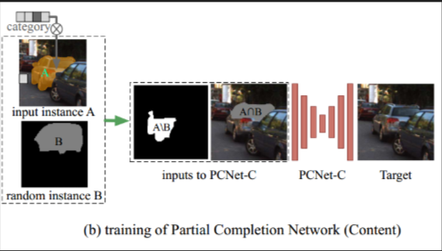 

## 2. Setup Instructions

- Clone the repo:

```shell
https://github.com/praeclarumjj3/PCNet-C-Experiments.git
cd PCNet-C-Experiments
```
- Install [Pytorch](https://pytorch.org/get-started/locally/) and other dependencies:

```shell
pip3 install -r requirements.txt
```

- Install pycocotools:
   
```shell
pip3 install "git+https://github.com/cocodataset/cocoapi.git#subdirectory=PythonAPI"
```

### Dataset Preparation

- Download the **MS-COCO 2014** images and unzip:
```
wget http://images.cocodataset.org/zips/train2014.zip
wget http://images.cocodataset.org/zips/val2014.zip
```

- Download the annotations and untar:
``` 
gdown https://drive.google.com/uc?id=0B8e3LNo7STslZURoTzhhMFpCelE
tar -xf annotations.tar.gz
```

- Unzip the files according to the following structure

```
PCNet-C-Experiments
├── data
│   ├── COCOA
│   │   ├── annotations
│   │   ├── train2014
│   │   ├── val2014
```

## 3. Experiments

### Training

1. Download the pre-trained image inpainting model using partial convolution [here](https://github.com/naoto0804/pytorch-inpainting-with-partial-conv/blob/master/README.md) to `pretrains/partialconv.pth`

2. Convert the model to accept 4 channel inputs.

    ```shell
    python tools/convert_pcnetc_pretrain.py
    ```

3. Train (taking COCOA for example).

    ```
    sh experiments/train.sh # you may have to set --nproc_per_node=#YOUR_GPUS
    ```

- In the plots below:
    - **Rec Loss** =  *λ<sub>1</sub>* L<sub>hole</sub> + *λ<sub>2</sub>* L<sub>valid</sub> + *λ<sub>3</sub>* L<sub>sty</sub> + *λ<sub>4</sub>* L<sub>prc</sub> + *λ<sub>5</sub>* L<sub>tv</sub>
        ```
        λ<sub>1</sub> = 6.0;
        λ<sub>2</sub> = 1.0;
        λ<sub>3</sub> = 250.0;
        λ<sub>4</sub> = 0.1;
        λ<sub>5</sub> = 0.1;
        ```
    - **Adv G Loss** = 0.1 * L<sub>gen_gan</sub>
    - **Adv D Loss** = L<sub>gen_disc</sub>

The model was trained for `45000 iterations`.

<p float="center">
  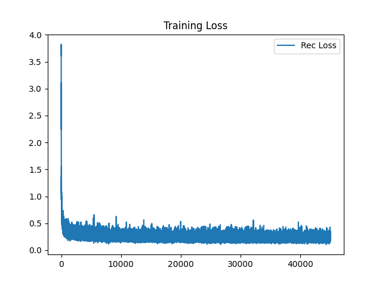
  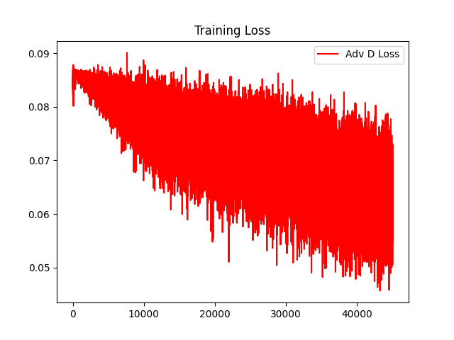
  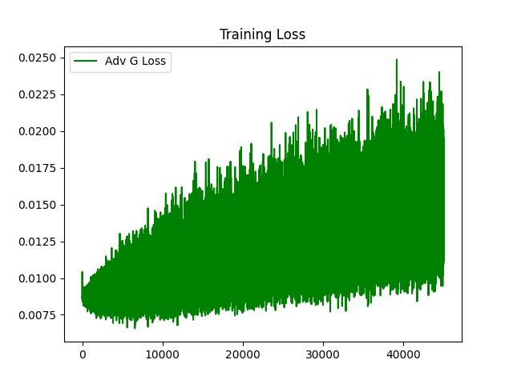
</p>

### Demo

Run the following command:
```shell
sh experiments/demo.sh
```

#### Using Pretrained Model
- Download released model from [here](https://drive.google.com/drive/folders/1O89ItVWucCoL_VxIbLM1XLxr9JFfyj_Y?usp=sharing), **rename it to G_iter_0.pth.tar** and put it the folder `saved_checkpoints` under `experiments`.

```shell
gdown https://drive.google.com/uc?id=1MFK3mvSsB_T6IhmunPHi0EUWnDv-nDTa
```

- Set the `--load_iter` parameter equal to `0` in [demo.sh](experiments/demo.sh).

## 4. Results

### Using my Trained model

<!-- image_0021/4 -->
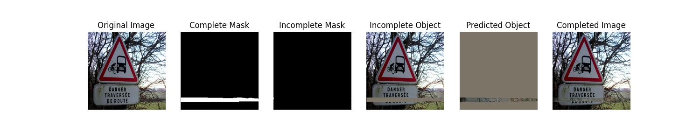

<!-- image_0002/2 -->
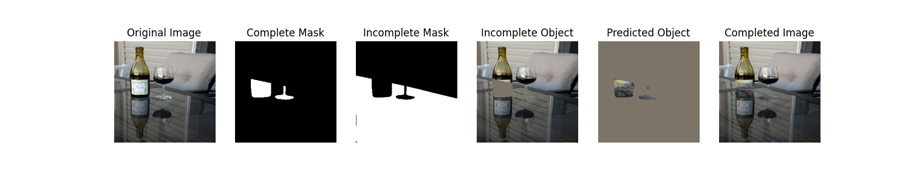 

<!-- image_0038/28 -->
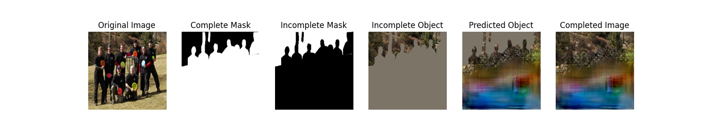 

<!-- image_0044/4 -->
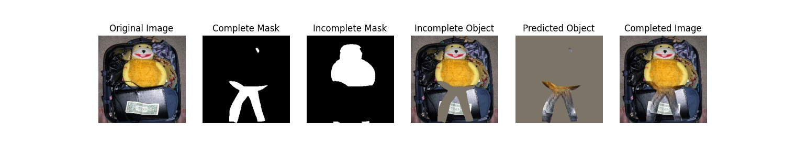 

### Using Pretrained model

<!-- image_0021/4 -->
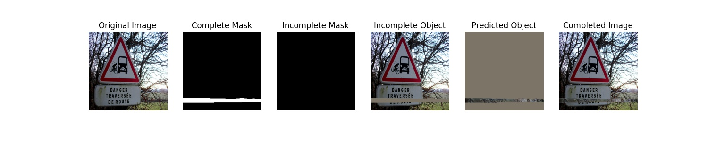

<!-- image_0002/2 -->
 

<!-- image_0038/28 -->
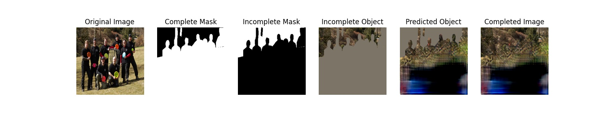 

<!-- image_0044/4 -->
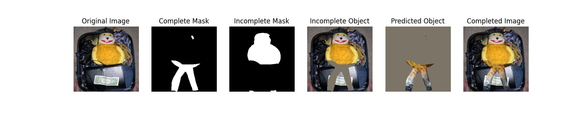 

## Acknowledgement

This repo borrows heavily from [deocclusion](https://github.com/XiaohangZhan/deocclusion).
